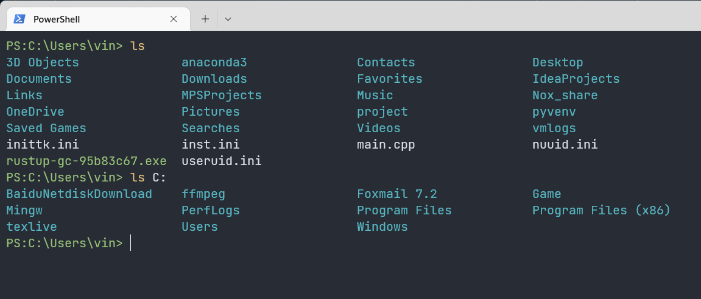

# Vin-s-Powershell-Profile
My Microsoft PowerShell Profile.

## Usage
Copy the contents of "Microsoft.PowerShell_profile.ps1" to you own PowerShell Profile.

## Feature
### 1. Modify "ls"
Folders are displayed in blue, executable files are displayed in green, other files are displayed in white when execute command "ls". And the result will be left justified.

