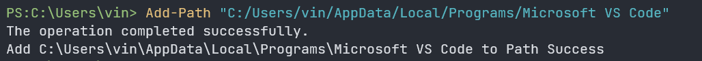

# Vin-s-Powershell-Profile
My Microsoft PowerShell Profile.

English | [简体中文](README-CN.md)
## Statement
This is my Microsoft PowerShell Profile. It is a script file like `/etc/profile` in Linux that is executed automatically when PowerShell starts. It is used to configure the environment of PowerShell. It is also a good place to put some useful functions.  
Based on Windows 11, PowerShell 5.1. So it's not suitable for other platforms like Linux, MacOSX and so on.  
I hope it can help you.

## Usage
Copy the contents of "Microsoft.PowerShell_profile.ps1" to you own PowerShell Profile.

## Feature
### 1.  Command "ls","la" and "ll"
`ls` command will list all files without hidden files.   
`la` command will list all files including hidden files. (Hidden file is such a file that starts with a dot,not truely hidden file in Windows)  
`ll` command will list all files including hidden files and show more details.  
Folders are displayed in blue, executable files are displayed in green, other files are displayed in white when execute command "ls". And the result will be left justified.


### 2. Add-Path command
`Add-Path` command can add a spectifc directory to user's PATH environment variable. 


#### Usage
Basic usage:
```powershell
Add-Path "C:/Users/vin/AppData/Local/Programs/Microsoft VS Code"
```
Besides,use relative path can reach the same effect:
```powershell
cd '.\AppData\Local\Programs\Microsoft VS Code\'
Add-Path "."
```